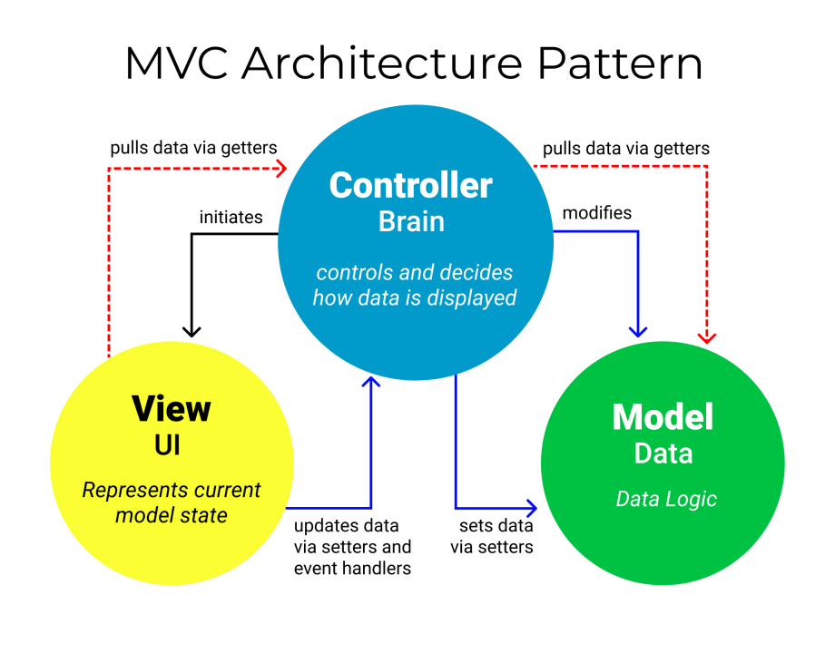

# Aestheitos

As someone who is a fitness and calisthenic enthusiast, I've set my goal of building a web app around my passion.There are many beginners who make lots of mistakes when starting their journey in fitness or calisthenics and don't know where to start. from a poorly structured workout or bad workout routine. That's the primary reason why I've wanted to create a learning management system or a learning platform particularly aimed at calisthenics and fitness.

I myself, who have trained and also made some mistakes for almost 4 years, wanted to share my testimonies and teach them what I've learned from my research, which is the purpose of this web application, and also let other users who have similar passions be able to create and teach.

> Motivation gets you going, But discipline keeps you growing

---
<!-- markdownlint-disable MD033 -->
<details>
<summary style="font-size: 1.7em; font-weight: bold"> Distinctiveness and Complexity </summary>

This project is an online learning platform dedicated to fitness and calisthenics. It allows users to enroll in training programs and courses created by verified users. Creating a course is never easy without a nice user interface.Each course includes a lecture, a training plan with workout demonstrations and a discussion or comment where users can interact with each other. The platform emphasizes community learning and engagement, making fitness education accessible and enjoyable for everyone. In addition, I've also implemented a blog where the admin or staff can create and post their own and let other users read the published blog. Of course, it should be easy to create a blog, in which I've integrated a WYSIWYG (What You See Is What You Get) for a nice UI/UX, which, in my opinion, is the reason why it is ***distinct*** from other apps.

Before I've started the implementation or coding of this project, I've first created my pseudocode, an outline, a class diagram for my models, watched some tutorials, read Django's Rest Framework (DRF), React and React-router documentation, etc. The main reason is that I wanted it to be interactive. Vite + React serves as the frontend, making this web app a Single Page. via communicating through the backend server with its rest endpoints, which is Django.

In my outline i have my own **specifications** (features) for my project, as follows:

> I'll just keep it short, :D

- **Models**: User, Blog, BlogComments Course, CourseComments, UserProgress, CourseContent,Section, SectionItem, Workouts, WrongExerciseForm, CorrectExerciseForm and Enrollment.
- **Register**: allows users to create or register for an account.
- **Create Course**: Users that are signed should be able to create their own training program or course by visiting the Create page.
  - Instructors should be able to provide a title, description, price, thumbnail, and difficulty level (beginner, intermediate, and advanced) for this course.
  - provide an overview structure (e.g., specify how many weeks or how long this course is, or provide valuable information and education) via a video or a lecture.
  - Instructors can create a section or accordion / modal specifying its frequency, i.e., how many times per week or how often it should be done from range (x, y), or their own heading / description
    - should provide details of the workout from top to bottom inside of our modal.
    - Should be able to add an accordion item or section item with its content either the workout routine or a readme / lecture
  - The User should be presented with a submit for review button.
  - Wysiwyg textfields? (optional feature).
- **Pending Courses**: Admins and staff should be able to visit a Pending page.displays all courses with the status pending.
  - Admins or staff should be able to review whether to approve a course or reject it.
  - Accepted and reviewed courses must notify the creator or instructor of that particular course.
- **Course Catalog**: Index page, where a list of available courses created by instructors is displayed. Each course must include a title, description, thumbnail, difficulty level, number of enrollees, rating, and posted time. All users can see this.
  - display the average course’s rating i.e the no. stars.
  - Sorted by Popularity and Recent.
- **Search**: :  Allow the user to type a query into the search box for a course.
  - if query similarly matches a course , display the course results.
  - clicking on any result course should redirect the user.
- **Course**: Clicking a course should redirect the user to a page where they can view the course’s details.
  - The user that is signed in and enrolled should be able to see the content where its elements (title, images, description, sections/modals, etc.) should be displayed; if not, don’t show the remaining content and ask the user to create an account or have them sign in ‘IF NOT AUTHENTICATED’, or if they are not enrolled,  ask the user to enroll.
  - Users that are signed in should also be able to track and manage their progress by marking the section / week as complete or checked (if enrolled).
  - User that are authenticated or signed and enrolled should be able to rate the program/course (from 1-5 scale).
  - If enrolled, display a checkbox per section in course content for progress tracking.
  - Instructors (creators of the course) and admins and staff should be able to remove or delete the course by displaying a delete button form.
  - Instructors (creator of the course) and admin and staff should be able to edit or modify the course, displaying a edit button form that causes them to redirect to another route.
- **Edit**: The admins or the authenticated Users should be able to edit the Courses or Blogs via redirecting them.
  - Instructor (creator of the course) or Author (creator of the blog)  should be able to edit by clicking **EDIT** button in the course content page and modify their work.
- **Delete**: Instructor (creator of the course) or Author (creator of the blog) should be able to delete by clicking **DELETE** button in the course content page or blog and delete their work
  - Only the creator of the course and staff can delete the course instance.
  - Only the staff can delete the blog instance
- *optional* **Animation**: Use ReactSpring for the home page implemented it yourself through trial and error
- **Enrollment**: Users who are authenticated should be able to enroll in a course.
  - Instructors shouldn’t be able to enroll in their own course ( but can enroll in other’s course)
- **Enrolled page**: Users who are signed should be able to visit an enrolled page and track their progress.
  - Users can remove it by unenrolling the course.
  - Display each course’s progress bar.
- **Comments**: Allows users to comment on course material and on a blog post.
  - Users who are authenticated should be able to comment on course material or blog post if not redirected to log in.
  - Users can reply to each other (replies should be indented).
  - Users should be able to click a edit button and modify their comment
  - They should be able to click a delete button and delete their comment
- **Create Blog**: Staff or superusers who are signed in should be able to write a new blog in an editor via its route and then click the submit post button.
  - Allows Staffs or Superuser to post a blog, which, if logged in, should be displayed with an editor and so that they can create their own blog.
  - Implement a wysiwyg editor using Quill for User experience and functionality
- **Blogs**: Users should be able to see all Blog posts from users, with the most recent posts first
- **Pagination**: On the page that display courses and blogs, for courses there should be only be 15 cards and 10 blog post on a page. If there are more than that, A “Next” button should appear to take the user to the next page of courses or blog posts (which should be older than the current page of courses and blog posts). if not on the first page, a “Previous” button should appear to take the user to the previous page as well

Well, besides all these, I've probably forgotten to document some other features. and went beyond the scope of my specification or outline.

This is my class diagram or database schema for my models. However, my models are changing often, so this is not updated or reflected to my django models.


  
Here's also my rough idea or flowchart of how a user might interact with my system, and this is just my plan, so everything might not be accurate and apply to the system itself:


So to simplify the scribble above, it's actually just an MVC pattern. DRF is the controlller and the model, while our React app is the view in this case.



Lastly, this is the **NOT** final of my UI tree. This is just a plan that I had in mind; however, it changed when I read the documentation for the React router. My real implementation is very far from this:

.jpeg)

Based on my explanations and everything that I've included, I would say that my project is fairly complex, if not much more complex than the given project that I've done in CS50W.

</details>

---

## Documentation

The spec is avaiable on SwaggerHub.

You can find the [REST API documentation here](https://app.swaggerhub.com/apis-docs/jerichokunserrano_gmail.com/AestheitosLMS/1.0.0).

## File Structure

<!-- markdownlint-disable MD033 -->
<details>

<summary style="font-size: 1.7em"> Backend </summary>

The Django Rest Framework makes it easier for us to design an API for CRUD (Create, Read, Update and Delete) operations.

## learn app

```None
learn
├── __pycache__
├── management
|  ├── __pycache
|  ├── runapscheduler
├──  migrations
├──  __init__.py 
├──  .gitignore 
├──  admin.py
├──  apps.py 
├──  custom_serializer.py
├──  helpers.py
├──  models.py
├──  serializers.py
├──  test_api.py
├──  test_api2.py
├──  test_models.py
├──  urls.py
└──  views.py
```

### `.gitignore`

Tells Git don't track files in here to be pushed.

### `admin.py`

Register models for Django's admin interface

```python
# existing code

admin.site.register(User)
admin.site.register(UserProgress)
admin.site.register(Course)
admin.site.register(CourseContent)
admin.site.register(CourseRating)
admin.site.register(CourseComments)

# existing code
```

### `helpers.py`

Helper Functions for Authentication, Lookup, and Custom Mixin, which are just overriden methods (polymorphism) to be used for inheritance

```python
# existing code

def user_authentication(request):
    """
    Validating token for authentication purposes.
    Ensure that the user is logged in.

    return user instance
    """

    token = request.COOKIES.get("jwt")

    if not token:
        raise AuthenticationFailed("Unauthenticated!")

    try:
        payload = jwt.decode(token, key="secret", algorithms=["HS256"])
    except jwt.ExpiredSignatureError:
        raise AuthenticationFailed("Unauthenticated!")

    user = User.objects.filter(id=payload["id"]).first()

    return user

def is_valid_ownership(user, course_id):
    """
    we check if this course belongs to the instructor(creator of the course)
    """
    # existing code...

class CreateAPIMixin(CreateModelMixin):
    """
    Apply this mixin for APIView that requires authentication before creating
    This is to override exisitng create method (Polymorphism).
    """

    def perform_create(self, serializer):
        user = user_authentication(self.request)

        # checking for additional arguements i.e pk so that our method will be flexible/ resuable for different serializers
        parameters = inspect.signature(serializer.save_with_auth_user).parameters
        if "pk" in parameters:
            try:
                serializer.save_with_auth_user(user, self.kwargs["pk"])
            except KeyError:
                serializer.save_with_auth_user(user, None)
        else:
            serializer.save_with_auth_user(user)

# existing code
```

### `models.py`

Django Models, or entities in the database, also created a custom method such as

```python
delete_with_auth_user(self, user):
    # if instance is not created by user 
    # raises an authentication failed
```

for instances that were only deleted by their creator.

```python
# existing code

class User(AbstractUser):
    # existing code

# other code

class Course(models.Model):
    """
    Represents a course in the learning platform.
    """

    STATUS_CHOICES = [
        ("P", "Pending"),
        ("A", "Approved"),
        ("R", "Rejected"),
    ]

    DIFFICULTY_CHOICES = [
        ("BG", "Beginner"),
        ("IN", "Intermediate"),
        ("AD", "Advanced"),
    ]
    title = models.CharField(max_length=100)
    description = models.TextField()
    thumbnail = models.ImageField(upload_to="images/", null=True, blank=True)
    difficulty = models.CharField(max_length=2, choices=DIFFICULTY_CHOICES)
    course_created = models.DateTimeField(auto_now_add=True)
    course_updated = models.DateTimeField(auto_now_add=True)
    created_by = models.ForeignKey(
        "User", on_delete=models.CASCADE, related_name="creator"
    )
    status = models.CharField(max_length=1, choices=STATUS_CHOICES, default="P")

    def __str__(self):
        return f"( id: {self.id}) Course: {self.title}. By {self.created_by.username}"

    def delete_with_auth_user(self, user):
        if self.created_by != user:
            raise AuthenticationFailed("Not allowed to delete")
        self.delete()

    def course_rating_average(self):
        return self.course_rating.aggregate(Avg('rating'))['rating__avg']

# existing code

```

### `serializers.py`

> Serializers allow complex data such as querysets and model instances to be converted to native Python datatypes that can then be easily rendered into JSON, XML or other content types. Serializers also provide deserialization, allowing parsed data to be converted back into complex types, after first validating the incoming data.
> The ModelSerializer class provides a shortcut that lets you automatically create a Serializer class with fields that correspond to the Model fields. - [**Django Rest Framework**](https://www.django-rest-framework.org/api-guide/serializers/#modelserializer)

In addition, I have created my own save method, which is similar to the delete method in `models.py`, i.e.

```python
def save_with_auth_user(self, user, pk, update=False):

    if self.instance.course.created_by != user:
        raise AuthenticationFailed("Not allowed to modify")
    self.save()
```

```python
# existing code

class UserSerializer(ModelSerializer):
    class Meta:
        model = User
        fields = "__all__"
        extra_kwargs = {"password": {"write_only": True}}

    # hashes password
    def create(self, validated_data):
        password = validated_data.pop("password", None)
        instance = self.Meta.model(**validated_data)
        if password is not None:
            instance.set_password(password)
        instance.save()
        return instance

# other code

class CourseSerializer(ModelSerializer):
    average_rating = serializers.SerializerMethodField()
    class Meta:
        model = Course
        fields = "__all__"
        read_only_fields = ["created_by"]

    def save_with_auth_user(self, user, pk, update=False):

        if update:
            # Check if 'read' is the only field being updated
            if set(self.validated_data.keys()) == {"read"}:
                self.instance.read = self.validated_data.get("read")
                self.instance.save(update_fields=["read"])
                return

            if "status" in self.validated_data and not user.is_staff:
                raise AuthenticationFailed("Only staff can change the status")

            if user.is_superuser or user.is_staff:
                self.save()
            elif self.instance.created_by == user:
                self.save()
            else:
                raise AuthenticationFailed("Not allowed to modify")

            self.save()
            return
        self.save(created_by=user)

# existing code
```

An example of this is that before saving the instance's data, the function will first check if this instance belongs to the user and raise an authentication failure if not.

```cURL
curl --location --request PATCH 'http://127.0.0.1:8000/course/55' \
--header 'Cookie: jwt=someJWTToken; access=someAccessToken; refresh=someRefreshToken' \
--header 'Content-Type: application/json' \
--data '{
    "title": "test for a change",
    "description": "test change",
    "thumbnail": null,
    "difficulty": "IN",
    "price": "123.00",
    "weeks": 123,
    "is_draft": false,
    "read": true
}'
```

```JSON
{
    "detail": "Not allowed to modify"
}
```

### `test_api.py`

Client testing is an important part of ensuring clients are able to perform certain operations.
This file contains test cases. utilizing the [DRF's API test cases](https://www.django-rest-framework.org/api-guide/testing/#api-test-cases)

### `test_api2.py`

This is just an extension for ```test_api.py```, which continues the remaining API testing.

### `test_models.py`

Django Testing: Ensure that Django models or databases work correctly as intended using assertions.

### `urls.py`

This contains all of our endpoints for the generic views that are in the ```views.py```.
The as_view():
> Store the original class on the view function.
>This allows us to discover information about the view when we do URL reverse lookups. Used for breadcrumb generation.

In simpler terms, the as_view() method is used with class-based views. This method converts a class into a view function that can be called when processing a request.

```python
# existing code

app_name = "learn"
urlpatterns = [

    # API CALLS
    path("register", RegisterView.as_view(), name="register"),
    path("login", LoginView.as_view(), name="login"),
    path("logout", LogoutView.as_view(), name="logout"),
    path("user/courses/progress", UserProgressList.as_view(), name="progress-list"),
    path("user/course/<int:pk>/progress", UserProgressDetail.as_view(), name="progress-detail"),
    path('courses', CourseList.as_view(), name='course-list'),
    path('course/<int:pk>/rate', CourseRatingView.as_view(), name="course-rating"),
    path('course/<int:pk>', CourseDetail.as_view(), name='course-detail'),
    path('course/<int:pk>/course-content', CourseContentDetail.as_view(), name='course-content'),
    path('workouts/course/<int:pk>', WorkoutList.as_view(), name="course-workout-list"),
    path('workout/<int:pk>/course', WorkoutDetail.as_view(), name="course-workout-detail"),
    # other route

]
```

### `views.py`

Last but not least, well, it's the main dish of our backend, or what i mean is the controller.
I've started coding with APIView, but I was repeating myself with the same operation for CRUD, and the code was very verbose, as it was very tedious to do.
in which I've decided to refactor it and use generic views as they are perfect for the CRUD pattern and applying the DRY (Don't Repeat Yourself) principle. though some exceptions are the register, login, and logout.

```python

class RegisterView(APIView):
    """
    Creates a newly Account
    """

    def post(self, request):
        serializer = UserSerializer(data=request.data)
        serializer.is_valid(raise_exception=True)
        serializer.save()
        return Response(serializer.data)

# other code

class CourseList(CreateAPIMixin, generics.ListCreateAPIView):
    """
    List all courses, or create a new course.
    """

    serializer_class = CourseSerializer
    queryset = Course.objects.all()
    pagination_class = CustomPagination

    # existing code


class CourseDetail(
    UpdateAPIMixin, DeleteAPIMixin, generics.RetrieveUpdateDestroyAPIView
):
    """
    Retrieve, update or delete a course instance
    """

    queryset = Course.objects.all()
    serializer_class = CourseSerializer

# existing code
```

Depending on the view if it's a suffix is List then often it's HTTP methods are GET and CREATE,
if it ends with Detail then often it has GET, PATCH OR PUT, and DELETE for that instance.

The pagination is only applied to CourseList (if there's a pagination = true argument) Or Enrollment views.

example:

```cURL

curl --location --request GET 'http://localhost:8000/courses?page=1&paginate=true' \
--header 'Cookie: jwt=someJWT.eyJpZCI6MTksImV4cCI6MTcwODY5OTQyNCwiaWF0IjoxNzA4MDk0NjI0fQ.WZ08AW0UHZ59TzVSHnp2wxX7z4IUhMn5FUZS_0Qxayc' \
--form 'title="testing testing is_Draft 2 123 "' \
--form 'description="fields hmmasdfafds"' \
--form 'difficulty="BG"' \
--form 'price="1"' \
--form 'weeks="3"' \
--form 'is_draft="false"'

```

```JSON
[
    {
        "id": 56,
        "average_rating": 1.0,
        "created_by_name": "jericho1050",
        "difficulty_display": "Beginner",
        "enrollee_count": 0,
        "title": "TEST",
        "description": "<p>TEST</p>",
        "thumbnail": null,
        "difficulty": "BG",
        "course_created": "2024-06-09",
        "course_updated": "2024-06-09T14:24:46.431690Z",
        "status": "A",
        "price": "0.00",
        "weeks": 3,
        "is_draft": false,
        "read": false,
        "created_by": 1
    },
    {
        //...course
    }
    {
        //...course
    }
    //etc
]
```

</details>

<details>
<summary style="font-size: 1.7em;">Frontend</summary>

We use Vite as our frontend tool for our single-page application.

## React App

Used [tree-cli](https://github.com/MrRaindrop/tree-cli?tab=readme-ov-file)

```None
 tree -l 3 -o out.txt --ignore 'dist, node_modules'
```

```None
/Aestheitos/frontend
├── README.md
├── cypress
|  ├── downloads
|  ├── e2e
|  |  ├── appBar.cy.js
|  |  ├── course.cy.js
|  |  ├── createCourse.cy.js
|  |  ├── index.cy.js
|  |  ├── signIn.cy.js
|  |  └── signUp.cy.js
|  ├── fixtures
|  |  ├── example.json
|  |  ├── profile.json
|  |  └── user.json
|  └── support
|     ├── commands.js
|     ├── component-index.html
|     ├── component.js
|     └── e2e.js
├── cypress.config.js
├── cypress.env.json
├── index.html
├── package-lock.json
├── package.json
├── src
|  ├── atoms
|  |  ├── accordionsAtom.jsx
|  |  ├── isErrorAtom.jsx
|  |  ├── profilePictureAtom.jsx
|  |  ├── snackbarAtom.jsx
|  |  ├── workoutDescriptionAtom.jsx
|  |  └── workoutsAtom.jsx
|  ├── components
|  |  ├── Accordion.jsx
|  |  ├── AccordionItem.jsx
|  |  ├── AddAccordion.jsx
|  |  ├── AddAccordionItem.jsx
|  |  ├── Appbar.jsx
|  |  ├── AreYouSureDialog.jsx
|  |  ├── AuthenticationWall.jsx
|  |  ├── Carousel.jsx
|  |  ├── CorrectFormDialog.jsx
|  |  ├── CourseCard.jsx
|  |  ├── CourseTitleTextField.jsx
|  |  ├── CreateCorrectFormDialog.jsx
|  |  ├── CreateWrongFormDialog.jsx
|  |  ├── CustomLinearProgress.jsx
|  |  ├── DescriptionTextField.jsx
|  |  ├── DifficultySelectForm.jsx
|  |  ├── Footer.jsx
|  |  ├── FormattedInput.jsx
|  |  ├── InputFileUpload.jsx
|  |  ├── LectureReadMeTextFields.jsx
|  |  ├── OverviewTextField.jsx
|  |  ├── PreviewCourseTextField.jsx
|  |  ├── ProgressMobileStepper.jsx
|  |  ├── SearchBar.jsx
|  |  ├── Snackbar.jsx
|  |  ├── WeeksTextField.jsx
|  |  ├── WorkoutCard.jsx
|  |  ├── WrongFormDialog.jsx
|  |  ├── csrftoken.jsx
|  |  └── protectedRoute.jsx
|  ├── contexts
|  |  ├── IsLoadingContext.jsx
|  |  └── authContext.jsx
|  ├── courses.js
|  ├── divider.css
|  ├── error-page.jsx
|  ├── helper
|  |  ├── atomFactory.jsx
|  |  ├── determineIntent.js
|  |  ├── getEmbedUrl.jsx
|  |  ├── parseDateTime.jsx
|  |  ├── persistJWT.jsx
|  |  ├── quillModule.jsx
|  |  ├── scrollToHashElement.jsx
|  |  ├── truncateText.js
|  |  ├── useRefreshToken.jsx
|  |  └── verifySignature.js
|  ├── index.css
|  ├── main.jsx
|  ├── routes
|  |  ├── approve-course.jsx
|  |  ├── blog.jsx
|  |  ├── blogs.jsx
|  |  ├── course.jsx
|  |  ├── create-blog.jsx
|  |  ├── create-course.jsx
|  |  ├── destroy-blog.jsx
|  |  ├── destroy-course.jsx
|  |  ├── edit-blog.jsx
|  |  ├── edit-course.jsx
|  |  ├── enrolled.jsx
|  |  ├── index.jsx
|  |  ├── pending.jsx
|  |  ├── privacy.jsx
|  |  ├── profile.jsx
|  |  ├── reject-course.jsx
|  |  ├── root.jsx
|  |  ├── signin.jsx
|  |  ├── signup.jsx
|  |  └── terms.jsx
|  ├── static
|  |  ├── editor
|  |  └── images
|  └── stories
|     ├── Accordion.stories.jsx
|     ├── AccordionCreate.stories.jsx
|     ├── AccordionItem.stories.jsx
|     ├── AddAccordion.stories.jsx
|     ├── AddAccordionItem.stories.jsx
|     ├── AreYouSureDialog.stories.jsx
|     ├── AuthenticationWall.stories.jsx
|     ├── Button.jsx
|     ├── Button.stories.js
|     ├── Carousel.stories.jsx
|     ├── Configure.mdx
|     ├── CorrectFormDialog.stories.jsx
|     ├── CourseCard.stories.jsx
|     ├── CourseTitleTextField.stories.jsx
|     ├── CreateCorrectFormDialog.stories.jsx
|     ├── CreateWrongFormDialog.stories.jsx
|     ├── CustomLinearProgress.stories.jsx
|     ├── DescriptionTextField.stories.jsx
|     ├── DifficultySelectForm.stories.jsx
|     ├── Footer.stories.jsx
|     ├── FormattedInput.stories.jsx
|     ├── Header.jsx
|     ├── Header.stories.js
|     ├── InputFileUpload.stories.jsx
|     ├── LectureReadMeTextFields.stories.jsx
|     ├── OverviewTextField.stories.jsx
|     ├── Page.jsx
|     ├── Page.stories.js
|     ├── ProgressMobileStepper.stories.jsx
|     ├── WeeksTextField.stories.jsx
|     ├── WorkoutCard.stories.jsx
|     ├── WrongFormDialog.stories.jsx
|     ├── assets
|     ├── button.css
|     ├── header.css
|     └── page.css
└── vite.config.js

directory: 1898 file: 5645

ignored: directory (208)
```

## Components

If you want a detailed and interactive comprehension of my components, I would recommend opening up the storybook (though I am being lazy about documenting the frontend).

Go  to the frontend directory

```node
aestheitos % cd frontend
```

once you're in here

```node
frontend %
```

Then run this

```node
frontend % npm run storybook
```

### Note

Since I'm using ReactQuill (and the package is still using a lower version of React), most of the time in the create-course and edit-course routes. It's kind of broken here in the storybook, so it doesn't look what I would expect.

Some components are unavailable to be auto-docs generated, which is kinda of disappointing also because of some error preventing me to mount them.

`null is not an object (evaluating 'theme.breakpoints')` this is because of the searchbar component

so i would just list them here.

```jsx
Appbar.jsx
```

and

```jsx
SearchBar.jsx
```

## Routes

### `main.jsx`

In main.jsx, if you already have prior knowledge of how the React router works, then it's pretty much self-explanatory of what's going on.i would recommend reading the [react router's tutorial](https://reactrouter.com/en/main/start/tutorial)

I've based my frontend's routing on React Router's tutorial, which I've pretty much found a nice read and am able to understand how this works.

```jsx
const router = createBrowserRouter([
  {
    path: "/",
    element: <Root />,
    errorElement: <ErrorPage />,
    loader: rootLoader,
    action: rootAction,
    children: [
      {
        errorElement: <ErrorPage />,
        children: [
          {
            index: true,
            element: <Index />,
            loader: indexLoader,
          },
          {
            path: "course/:courseId",
            element: <Course />,
            loader: courseLoader,
            action: courseAction,
          },
          {
            path: "profile/user/:userId",
            element: <Profile />,
            loader: profileLoader,
          },
          // existing codes here
        ],
      },
      {
        element: <ProectedRoute />,
        errorElement: <ErrorPage />,
        children: [
          {
            path: "course/create",
            element: <CreateCourse />,
            action: createCourseAction,
          },
          {
            path: "course/:courseId/edit",
            element: <EditCourse />,
            loader: editCourseLoader,
            action: editCourseAction,
          },
          // existing codes here
        ]
      }
]);
```

</details>

## Installation

1. Clone the repo with

```bash
git clone https://github.com/jericho1050/Aestheitos.git
```

2. Change to the aestheitos directory, then Create Your own Virtual Enviroment

```bash
aestheitos % virtualenv env
```

or

```bash
aestheitos % python -m env
```

3. Activate env

```bash
aestheitos %  source env/bin/activate
```

4. download the dependencies in requirements.txt

```bash
(env) aestheitos % pip install -r requirements.txt
```

5. makemigrations and migrate, to apply and create the **sqlite3.db** (if you want postgresql then go to the PostgreSQL section)

```bash
(env) aestheitos % python manage.py makemigrations learn
(env) aestheitos % python manage.py migrate
```

6. Run the django local dev server

```bash
(env) aestheitos % python manage.py runserver
```

7. Change to the frontend directory, then create a `.env` file

your file structure should look like this

```bash
/Aestheitos/frontend
├── README.md
├── cypress
├── cypress.config.js
├── cypress.env.json
├── index.html
├── package-lock.json
├── package.json
├── src
├── .env
└── vite.config.js
```

in `.env` copy this code

```python
VITE_API_URL = 'http://localhost:8000/' # use this in development to persist the set Cookies i.e JWT 

# VITE_API_URL = 'http://127.0.0.1:8000/' # please use this for testing as localhost cause some CORS error
```

8. install the necessary dependencies for this React Vite app

```npm
frontend % npm install --legacy-peer-deps
```

9. Then you can run the vite local dev server

```npm
frontend % npm run dev
```

## PostgreSQL Set Up  (MacOS)

If you want to use PostgreSQL and also run the jobs scheduler (CRON), you need to install it on your local machine and run it on the background or use Docker.

option 2 requires [homebrew](https://brew.sh) (a package manager)

### Option 1 (Docker)

Make sure you have Docker Desktop installed and is opened

```yaml
(env) aestheitos % docker-compose build
```

```yaml
(env) aestheitos % docker-compose up
```

That's it. Now you can go to step 7 in the installation section.

### Option 2 (Manual)

[reference stackoverflow](https://stackoverflow.com/a/70941627/23952603)

- in your terminal deactivate the virtual enviroment first
  
```bash
(env) aestheitos % deactivate
```

- in the base directory, create a enviroment variable ( `.env` file )

so it would look like this

├── Aestheitos
├── Dockerfile
├── LICENSE
├── README.md
├── db.sqlite3
├── docker-compose.yml
├── .env
├── frontend
├── images
├── learn
├── manage.py
├── requirements.txt

- inside the `.env` file paste this

```python
POSTGRES_DB="mydatabase"
POSTGRES_USER="jericho1050"
POSTGRES_PASSWORD="yourpassword"
```

- also in `settings.py` in Aestheitos directory. Follow this code here
  
```python
# If you're interested in using PostgreSQL then use this
DATABASES = {
    "default": {
        "ENGINE": "django.db.backends.postgresql",
        "NAME": os.getenv('POSTGRES_DB'),
        "USER": os.getenv('POSTGRES_USER'),
        "PASSWORD": os.getenv('POSTGRES_PASSWORD'),
        "HOST": "127.0.0.1",
        "PORT": "5432",
    }
}

# if you're interested in using Sqlite3 then use this
# DATABASES = {
#     "default": {
#         "ENGINE": "django.db.backends.sqlite3",
#         "NAME": BASE_DIR / "db.sqlite3",
#     }
# }
```

- Download postgrew with homebrew

```bash
aestheitos % brew install postgresql@16
```

- after installation
  
```bash
If you need to have postgresql@16 first in your PATH, run:
  echo 'export PATH="/opt/homebrew/opt/postgresql@16/bin:$PATH"' >> ~/.zshrc
```

- then create first the database

```bash
aestheitos % createdb mydatabase
```

- then create a role, i.e., the user.

```bash
aestheitos % createuser -s youruser 
```

- then try to restart postgre service
  
```bash
aestheitos % brew services restart postgresql
```

- you can now activate the virutal enviroment and start the django server

```bash
(env) aestheitos % python manage.py runserver
```

- In a new terminal, you can also use the job scheduler (CRON). The purpose of this is to declutter draft courses that the user didn't submit for a reasonable number of days, as well as courses that were rejected. so those will be deleted.

```bash
(env) aestheitos % python manage.py runapscheduler
```

---

## Testing

### Django test

```bash
(env) aestheitos % python manage.py test
```

### Cypress

Nah, I didn't really test my components, nor did I do any unit testing for frontend. And also, the e2e testing is not complete because I got tired and it's running slowly. It's high fidelity for real

before running the Cypress e2e test use the 127.0.0.1 as host address in `.env` file.

Also, create some mockup lists of courses and fill them up as much as you can.

``` python
VITE_API_URL = 'http://127.0.0.1:8000/' # please use this for testing as localhost cause some CORS error
```

then open up the cypress

```bash
frontend % npm run cypress:open
```

